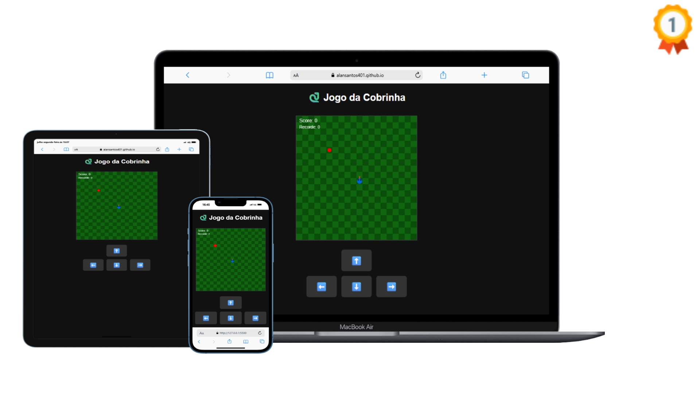

# 🐍 Jogo da Cobrinha

Um jogo da cobrinha clássico feito com HTML, CSS e JavaScript.  
🏆 Premiado como "Projeto do Mês - DevClub (Abril)".

## 🚀 Como jogar
Abra o <a href="https://lucasferreiraprogramador.github.io/Jogo-da-cobrinha/" target="_blank" rel="noopener noreferrer">jogo da cobrinha online</a> no navegador e divirta-se!

## 📁 Tecnologias
- HTML5
- CSS3
- JavaScript puro

---
## 👤 Autor
- **Lucas Ferreira**
- [GitHub](https://github.com/LucasFerreiraProgramador)
- [LinkedIn](https://www.linkedin.com/in/lucasferreira-dev-front-end/)

## 📄 Licença
Este projeto foi desenvolvido para fins de estudo e prática de desenvolvimento Front-End.
